# 开发路径结构图：AI 辅导员 Demo

日期：2026-05-19
状态：active
用途：用一张图显示当前任务节点、审批门控和下一步工作

## 1. 读图规则

- `DONE`：已完成并记录证据。
- `APPROVED`：已通过审批，但后续实现仍可能受门控约束。
- `NEXT`：当前下一步。
- `TODO`：尚未开始。
- `BLOCKED`：受审批、契约或阶段门控限制，不能直接实现。

## 2. 开发路径图

```mermaid
flowchart TD
    A[Phase 0 需求与测试基线<br/>DONE] --> B[后端 AI/RAG 编排审批 SDAR-0001<br/>APPROVED]
    B --> C[前端技术栈审批 SDAR-0002<br/>APPROVED]
    C --> D[前端 IA / 路由图审批 SDAR-0003<br/>APPROVED]
    D --> E[前端页面结构与交互顺序 SDAR-0005<br/>APPROVED]
    E --> F[前端视觉方向与 Design Token SDAR-0004<br/>APPROVED]
    F --> G[Contract / Data Boundary Node<br/>SDAR-0006 APPROVED]
    G --> H[Phase 2 登录与角色路由<br/>IN PROGRESS]
    H --> H1[P2-N1 后端 Auth/Session 契约对齐<br/>DONE]
    H1 --> H2[P2-N2 React 登录/角色路由 Skeleton<br/>DONE]
    H2 --> HS[前端设计/组件/React skills 补充<br/>DONE]
    HS --> H3[P2-N3 顶部导航/身份展示微调<br/>IN PROGRESS]
    H3 --> H4[P2-N3 顶部导航 + 首页第一屏打磨<br/>DONE]
    H4 --> H5[P2-N3 产品经理视觉复核与下一轮微调<br/>IN PROGRESS]
    H5 --> H6[P2-N3 首页 3D 飞翼共识 Demo<br/>DONE]
    H6 --> H7[P2-N3 首页 3D 飞翼视觉验收：当前效果较差<br/>DONE]
    H7 --> H8[P2-N3 动效 skills 补强<br/>DONE]
    H8 --> H9[P2-N3 PNG/mask 原型修复与客观否决<br/>DONE]
    H9 --> H10[P2-N3 独立 SVG 飞翼视觉实验页 v3<br/>DONE]
    H10 --> H11[P2-N3 校徽飞翼终版动效列为技术债<br/>DONE]
    H11 --> H12[SDAR-0007 首页电影感首屏与强滚动叙事<br/>APPROVED]
    H12 --> H13[P2-N3 首页电影感首屏与强滚动叙事实现<br/>DONE]
    H13 --> H14[P2-N3 产品经理浏览器复核与视觉微调<br/>IN PROGRESS]
    H14 --> H15[P2-N3 暗色高级动效评审原型增强<br/>DONE]
    H15 --> H16[P2-N3 产品经理复核增强版原型<br/>NEXT]
    H16 --> P3R0[SDAR-0008 真实模型学生 Chatbox 边界<br/>APPROVED]
    P3R0 --> I[Phase 3R 学生 Chatbox 小闭环<br/>IN PROGRESS]
    I --> J[Phase 4 管理员知识域与 Demo 重置<br/>TODO]
    J --> K[Phase 5 辅导员流程<br/>TODO]
    K --> L[Phase 6 持久化加固<br/>TODO]
    L --> M[Phase 7 知识库 / RAG 集成<br/>TODO]
    M --> N[Phase 8 响应式 QA 与产品打磨<br/>TODO]
    N --> O[Phase 9 Docker / 部署 Smoke<br/>TODO]

    style G fill:#ecfdf5,stroke:#10b981
    style H fill:#fff7ed,stroke:#f97316,stroke-width:2px
    style H1 fill:#ecfdf5,stroke:#10b981
    style H2 fill:#ecfdf5,stroke:#10b981
    style HS fill:#ecfdf5,stroke:#10b981
    style H3 fill:#ecfdf5,stroke:#10b981
    style H4 fill:#ecfdf5,stroke:#10b981
    style H5 fill:#fff7ed,stroke:#f97316,stroke-width:2px
    style H6 fill:#ecfdf5,stroke:#10b981
    style H7 fill:#ecfdf5,stroke:#10b981
    style H8 fill:#ecfdf5,stroke:#10b981
    style H9 fill:#ecfdf5,stroke:#10b981
    style H10 fill:#ecfdf5,stroke:#10b981
    style H11 fill:#ecfdf5,stroke:#10b981
    style H12 fill:#ecfdf5,stroke:#10b981
    style H13 fill:#ecfdf5,stroke:#10b981
    style H14 fill:#fff7ed,stroke:#f97316,stroke-width:2px
    style H15 fill:#ecfdf5,stroke:#10b981
    style H16 fill:#fff7ed,stroke:#f97316,stroke-width:2px
    style P3R0 fill:#ecfdf5,stroke:#10b981
    style I fill:#fff7ed,stroke:#f97316,stroke-width:2px
    style F fill:#ecfeff,stroke:#06b6d4,stroke-width:1.5px
    style B fill:#ecfdf5,stroke:#10b981
    style C fill:#ecfdf5,stroke:#10b981
    style D fill:#ecfdf5,stroke:#10b981
    style E fill:#ecfdf5,stroke:#10b981
```

## 3. 当前节点说明

### 当前正在做什么

- 当前节点：`Phase 2 登录与角色路由`
- 当前任务：P2-N3 产品经理浏览器复核首页暗色高级动效多版本评审原型
- 当前门控：P2-N1/P2-N2 已完成并通过自动验证；SDAR-0007 已批准并完成第一版实现；Phase 2 后续仍不得引入真实学生数据、生产 SSO、数据库 schema、RAG/vector/provider
- 并行审批包：`SDAR-0008` 真实模型学生 Chatbox 边界已由产品经理在文件中审阅通过；Phase 3R 可进入执行，但必须复用项目文件中已配置好的 Qwen 模型 API，不新增第二套模型 API 配置。

### 下一步

1. 产品经理打开评审原型：`http://127.0.0.1:5188/.omx/prototypes/homepage-dark-hud-variants.html`。
2. 重点检查：A1/A2/A3 三版暗色高级质感、Linear-like 顶部栏、C 式 HUD 启动动效、右侧视频/HUD 占位、下滑章节结构。
3. 若其中一版通过，再将该方向落到正式 React 首页；若不通过，继续在评审原型范围内微调，不直接改正式首页。
4. Phase 3R 进入 P3R-N2：读取既有 Qwen 配置并实现后端真实模型流式代理；随后进入 P3R-N3：实现独立学生 Chatbox 页面。

## 4. 已完成节点

- Phase 0 需求与测试基线
- SDAR-0001 后端 AI/RAG 编排
- SDAR-0002 前端技术栈
- SDAR-0003 前端 IA / 路由图
- SDAR-0005 前端页面结构与交互顺序
- SDAR-0004 前端视觉方向与 Design Token
- SDAR-0006 产品数据契约边界

## 5. 当前节点

- Phase 2 登录与角色路由
- 当前状态：`IN PROGRESS`
- 进入证据：产品经理回复“好的，进入Phase 2”；`SDAR-0006` 已标记为 `approved`。
- 已完成：P2-N1 后端 Auth/Session 契约对齐，验证为 17 个后端测试通过，ruff 通过。
- 已完成：P2-N2 React 登录/角色路由 skeleton，验证为前端 build/lint 通过，前后端登录 smoke 通过。
- 已完成：前端设计/组件/React skills 补充，包含 `frontend-design`、`ui-ux-pro-max`、`shadcn-component-discovery`、`shadcn-component-review`、`playwright`、`screenshot`、`vercel-react-best-practices`。
- 已完成：P2-N3 第一轮顶部导航/身份展示微调，验证为前端 build/lint 通过，`http://127.0.0.1:5173` 返回 HTTP 200。
- 已完成：P2-N3 顶部导航 + 首页第一屏打磨，验证为前端 build/lint 通过，并产出桌面/移动 Playwright 截图证据。
- 已完成：P2-N3 首页 3D 飞翼共识 Demo v2，文件为 `.omx/prototypes/homepage-3d-wing-consensus-demo.html`，已按 Ant Design X 式全幅首屏重做；右侧为校徽飞翼符号三部件 SVG，包含部件飞入拼合与整体悬浮动画；验证为本地 HTTP 200，并包含 `NCHU AI`、`智能辅导新秩序`、`piece-main`、`piece-top`、`piece-tail`、`flyMain`、`aircraftIdle` 等关键结构。
- 验证限制：Chrome headless 截图命令当前未稳定写出截图文件，因此本轮以浏览器服务 200 和 HTML/CSS/SVG 结构检查作为交付验证。
- 已完成：产品经理复核后认为当前原型效果较差，要求先补强动效 skills，再进行下一轮原型开发。
- 已完成：动效 skills 补强，包含 `gsap-core`、`gsap-timeline`、`gsap-plugins`、`gsap-react`、`gsap-performance`、`svg-animations`。
- 已完成：基于官网校徽中心飞翼提取资产重做首页飞翼 PNG/mask 原型 v9，并在产品经理截图反馈后确认该路径存在渲染稳定性和质感问题，不再作为主修复方向。
- 已完成：创建独立 SVG 飞翼视觉实验页 `.omx/prototypes/homepage-wing-visual-lab.html`，v3 使用校徽提取图 alpha 轮廓作为 SVG 面片约束，保留部件飞入与整体悬浮。
- 当前视觉 verdict：76/100，可作为产品经理讨论实验页；仍不建议直接作为生产实现，正式 React 实现前需继续压低右侧竖面厚重感、优化飞入帧可读性，并决定是否继续手工矢量化。
- 已完成：根据产品经理决定，校徽飞翼终版动效进入技术债 `TD-0001`，当前不继续消耗实现周期。
- 已完成：`SDAR-0007` 首页电影感首屏与强滚动叙事审批通过，允许新增 `gsap` 和 `@gsap/react`，但不允许新增 Three.js、Lottie、Rive、Lenis 或真实学校素材。
- 已完成：P2-N3 首页电影感首屏与强滚动叙事第一版 React 实现，保留登录与角色路由逻辑，首屏使用本地 SVG/CSS/GSAP 抽象航空 AI 动效槽位，四章滚动叙事为学生咨询、辅导员辅助、知识运维、可信边界。
- 验证证据：`npm run build` 通过；`npm run lint` 通过；`http://127.0.0.1:5173` 返回 200；首页 CTA 可进入 `/login`；学生 Demo 登录 smoke 可进入 `/app/student`；桌面/移动/滚动章节截图已产出到 `output/playwright/`。
- 已知非阻塞项：Vite build 存在 chunk size warning，原因是当前 React/Ant Design/GSAP 打包体积较大，后续可在性能优化节点评估代码分割。
- 已完成：针对 `.omx/prototypes/homepage-linear-text-motion-demo.html` 动效不可见反馈做原型级诊断与修正；结论为 GSAP 实际运行但原型播放太快且缺少状态反馈。已增加 0.35x 慢速预览、1x 正常预览、延迟自动播放、播放状态与进度条；Playwright 采样验证 0ms 隐藏、500ms/2400ms/4200ms 持续过渡，控制台 0 errors / 0 warnings。
- 已完成：根据产品经理澄清，修复高级动效 Lab `.omx/prototypes/homepage-tech-text-motion-lab.html` 的查看能力；补齐强制预览、单独/全部重播、0.5x 慢速、1x 正常、播放状态和进度条，并修复 `tl.defaults is not a function` 脚本错误。Playwright 验证控制台 0 errors / 0 warnings，`2 光扫` 在 2400ms 已可见且处于播放中。
- 已完成：根据产品经理最新方向，创建暗色高级多版本评审原型 `.omx/prototypes/homepage-dark-hud-variants.html`。三版分别为 A1 Obsidian Command、A2 Aero Glass、A3 Liquid Intelligence；包含变体切换、重播、轮播、0.5x/1x 速度、播放状态与进度条。本次未修改正式 React 首页，未新增依赖。
- 验证证据：`http://127.0.0.1:5188/.omx/prototypes/homepage-dark-hud-variants.html` 返回 200；Playwright 浏览器检查控制台 0 errors / 0 warnings；A1 标题从隐藏态过渡到显示态；A2/A3 切换后可见；截图为 `output/playwright/homepage-dark-hud-variants-1280-v2.png` 和 `output/playwright/homepage-dark-hud-variants-verify.png`。
- 已完成：根据产品经理反馈“好多动效没有加进去”，增强暗色高级多版本评审原型。新增 boot curtain、导航扫光、标题行内扫光、流程标签、雷达扫描、飞翼轨迹、飞翼飞入 keyframes、HUD 日志逐步进入和滚动章节切换；默认播放速度调整为 `1x`，保留 `0.5x` 慢速复核。
- 已完成：在 `.omx/prototypes/homepage-linear-text-motion-demo.html` 增加“打开暗色高级动效方案”入口，避免产品经理停留在旧 Demo 页面看不到新版方案。
- 最新验证证据：Playwright 浏览器脚本检查控制台 `0 errors / 0 warnings`；首屏标题、流程标签、雷达、飞翼均进入显示态；滚动采样可切换至“知识运维 / CHAPTER 03 / ADMIN”；点击 A2 后 active variant 为 `aero`。截图为 `output/playwright/homepage-dark-hud-variants-final-t0700.png`、`output/playwright/homepage-dark-hud-variants-final-t2800.png`、`output/playwright/homepage-dark-hud-variants-enhanced-browser-story.png`、`output/playwright/homepage-linear-demo-with-dark-link.png`。
- 已完成：根据产品经理澄清，“常驻动效”不是 A/B/C 调试栏说明，而是首页首屏入场动画完成后，按钮、卡片、右侧 HUD/飞翼/扫描线继续像循环视频一样播放。已在 `.omx/prototypes/homepage-dark-hud-variants.html` 增加 `is-idle-playing` 状态和独立 GSAP `idleTimeline`，并让 CTA、流程标签、信号卡片、右侧视觉面板、扫描线、飞翼、尾迹、雷达、节点、路径、HUD 线条/日志/指标持续运动。
- 最新验证证据：Playwright CLI 检查控制台 `0 errors / 0 warnings`；运行态为 `data-idle-motion="running"`，active hero class 为 `hero-variant is-active is-ambient-ready is-idle-playing`，状态栏为 `常驻动效运行中：A1 黑曜指挥舱 / A 呼吸光`；飞翼 transform、CTA transform、HUD line transform 在间隔采样中发生变化；横向溢出为 `0`；截图为 `output/playwright/homepage-persistent-idle-after.png`。详情见 `.omx/logs/homepage-persistent-idle-motion-20260525.md`。
- 已完成：根据产品经理复核反馈“当前打开 `#features` 仍看不到常驻动效”，修复暗色高级评审原型的章节区常驻动效覆盖范围。此前常驻 idle 主要绑定首屏 `.hero-variant`，本次新增 `#features` / `.story-section` 的 `is-story-idle` 状态、CSS 常驻扫光/呼吸/设备扫描层，以及独立 GSAP `storyIdleTimeline`，覆盖左侧四张 `[data-story-card]`、右侧 `[data-chapter-panel]`、`.chapter-screen`、`.chapter-device` 和线条 HUD。
- 最新验证证据：内联脚本编译检查 `4/4 scripts ok`；`http://127.0.0.1:5188/.omx/prototypes/homepage-dark-hud-variants.html#features` 返回 200；真实浏览器脚本先进入首页再滚动到 `#features` 后采样，控制台错误为 `[]`，运行态为 `window.__nchuStoryIdleMotion.active=true`、`.story-section` class 为 `story-section is-story-idle`、`data-story-idle="running"`；1.4 秒间隔内 active card、chapter screen、active panel、chapter device、device line 的 transform 均发生变化；截图为 `output/playwright/homepage-features-idle-verified.png`，延时对比截图为 `output/playwright/homepage-features-idle-t3800.png`、`output/playwright/homepage-features-idle-t5400.png`、`output/playwright/homepage-features-idle-final.png`。
- 下一步：产品经理复核增强版暗色高级多版本评审原型；通过后再进入正式 React 首页落地，不通过则继续在原型中微调。

## 6. 更新规则

每完成一个任务节点、审批包、验证动作或验收动作，都要同步更新：

- `.omx/logs/current-assets-progress-ai-counselor-demo-20260519.md`
- 本文件
- 相关 SDAR、计划或 context 文件
## 2026-05-25 Update: Phase 3R Student Chatbox Implementation

- `SDAR-0008` approval has moved from boundary approval into implementation evidence.
- Phase 3R P3R-N2 completed: backend Qwen/DashScope real-model stream proxy added at `POST /api/v1/student/chat/stream`; the implementation reuses existing legacy Qwen/DashScope env names and does not introduce a second model API family.
- Phase 3R P3R-N3 completed: isolated frontend route `/app/student/chatbox` added; `/app/student` remains the existing role workspace and only links into the isolated Chatbox.
- Implemented Chatbox capabilities: streaming output, stop generation, retry, error state, new chat, and current in-memory runtime conversation history.
- Verification completed: backend `python -m ruff check .` passed; backend `python -m pytest` passed with 20 tests; frontend `npm run lint` passed; frontend `npm run build` passed with the existing chunk size warning.
- Browser smoke evidence: student login, Chatbox entry, real Qwen/DashScope streamed reply, stop generation, new chat, runtime history rail, console `0 errors / 0 warnings`.
- Evidence screenshot: `output/playwright/p3r-student-chatbox-smoke.png`.
- Local smoke note: normal backend startup still requires PostgreSQL; browser smoke used `uvicorn --lifespan off` for the in-memory Chatbox path.
