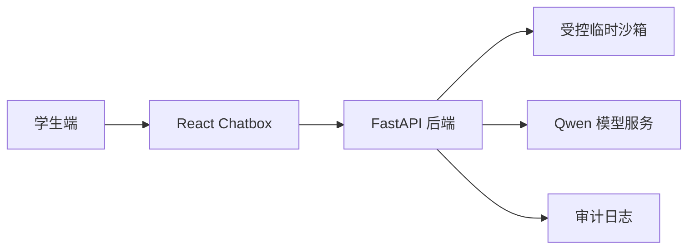

# AI 辅导员网站 - 完整技术架构方案

> 项目背景：根据《高等学校辅导员职业能力标准》，开发一个能嵌入教务系统的 AI 辅导员网站，内置 AI 模型，实现智能辅导功能。

## 一、整体技术架构图

### 1.1 架构概览

## 二、核心模块

- 学生 Chatbox：用于提交学习、生活和作业相关问题。
- 文件读取：用于阅读学生上传的作业、Markdown 方案或代码文件。
- 受控沙箱：仅允许白名单命令，限制目录和超时。
- 过程时间线：展示理解任务、读取文件、执行命令、整理结果和生成回答。

## 三、验收重点

AI 回答必须明确说明它已经读取到这份 Markdown，并能基于“整体技术架构图”“核心模块”“验收重点”整理内容。
